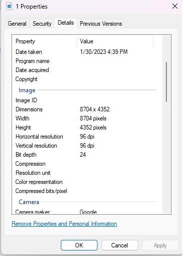
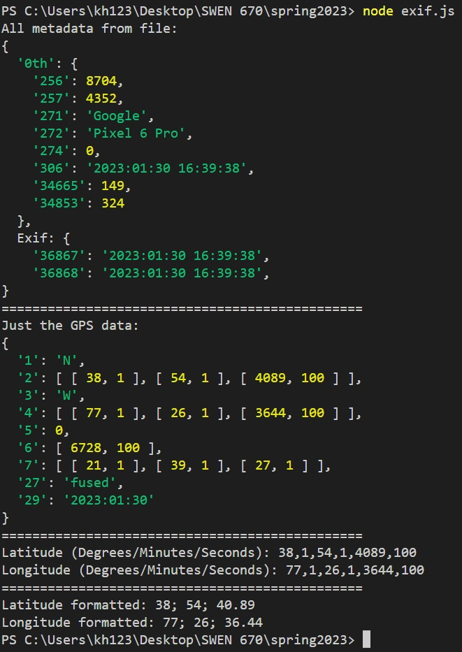

# Exif / Metadata Extraction from JPG File.

If the image contains geographic metadata in the file, we can use the Piexifjs library via Node.js.  

Items of interest:

- phone details (model, width, height)
- time picture was taken
- longitude and latitude (in degrees/minutes/seconds format)

**Piexifjs library**: https://github.com/hMatoba/piexifjs

**Implementation documentation** : https://auth0.com/blog/read-edit-exif-metadata-in-photos-with-javascript/

## To run this example:

1. Download node.js on local machine (https://nodejs.org/en/download/).
2. Download Piexifjs via "npm install piexifjs" in the terminal.
3. Run "node exif.js" in the terminal.
4. View the metadata of panoramic image.

## Image that is used in this example:

   

## The jpg file's properties:

   

## Extracting the file's metadata with this branch's exif.js file:

