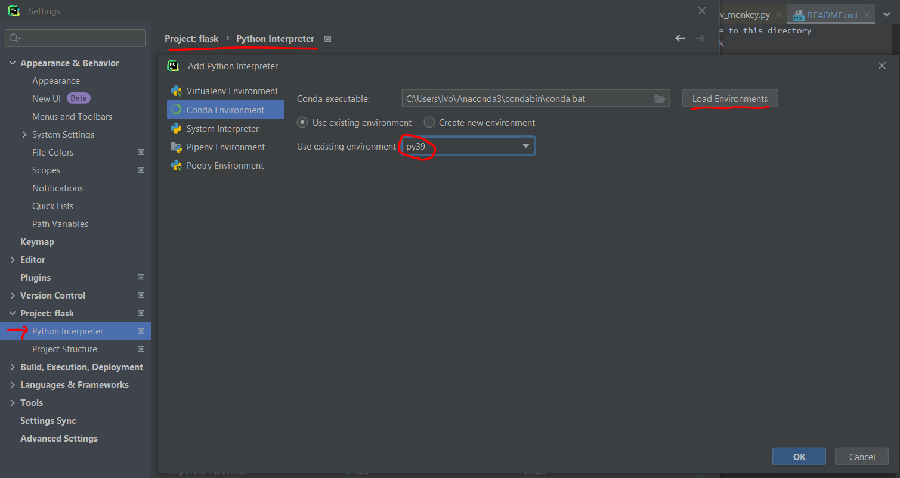

# Setup

## IDE Recommendation

Install PyCharm (Community Edition should be ok)
https://www.jetbrains.com/pycharm/download/#section=windows

Import the project from THIS folder (flask)

## Create Virtual Environment

### 1. Python Required Version: 3.9

We have a dependency on a library called "easyorc", and it requires python 3.9 or lower.

#### We recommended to install Anaconda

This will allow us to control versions of python more easily
https://www.anaconda.com/products/distribution

### 2. Restart your computer

### 3. Create the environment

```
# Change to this directory
cd flask

# Pointing to the correct version of python: Create virtual environment
conda create -n py39 python=3.9.16

# type 'y', to accept the prompt
```

### 4. Activate Virtual Environment

```
conda activate py39
```

Note, if you get "cannot be loaded because its operation is blocked by software restriction       
policies, such as those created by using Group Policy."

Then run ```Set-ExecutionPolicy -ExecutionPolicy Bypass -Scope Process``` and try again

### 5. Setup IDE to use conda environment



## Install Software Dependencies 

### Install python libraries
```
pip install -r requirements.txt --user
```

### Install pytorch

## Run Tests

To run all tests
```
pytest app/tests/
```

To run just one test class
```
pytest app/tests/tour/tour_update_test.py
```

## Run Server

```
python run.py
```

To run integration tests. This will populate test data.
```
pytest app/integration_tests
```

Navigate to `api/site-map` to access the REST APIs.

See [app\apis.py](vsp/apis.py) for complete supported REST APIs operation.

Example of REST API endpoints:

```
/api/                  -- [GET] hello world
/api/tours             -- [GET] get list of tours
/api/tour/<id>         -- [GET] get tour by id
/api/tour-name/<name>  -- [GET] get tour by name
/api/tour/add          -- [POST] add new tour with JSON data payload:
/api/update/tour/<id>  -- [POST/PUT] update tour by id with JSON data payload
/api/delete/tour/<id>  -- [POST/DELETE] delete tour by id
/api/tour/add/images/  -- [POST] upload images to server
/api/tour/images/raw-images/<string:tour_name>/<int:location_id>  -- [GET] Retrieve raw image paths for a given tour name and location_id
/api/tour/images/panoramic/<string:tour_name>/<int:location_id>  -- [GET] Retrieve panoramic image 
/api/tour/images/panoramic/<string:tour_name>/<int:location_id>  -- [GET] Retrieve panoramic image 
```